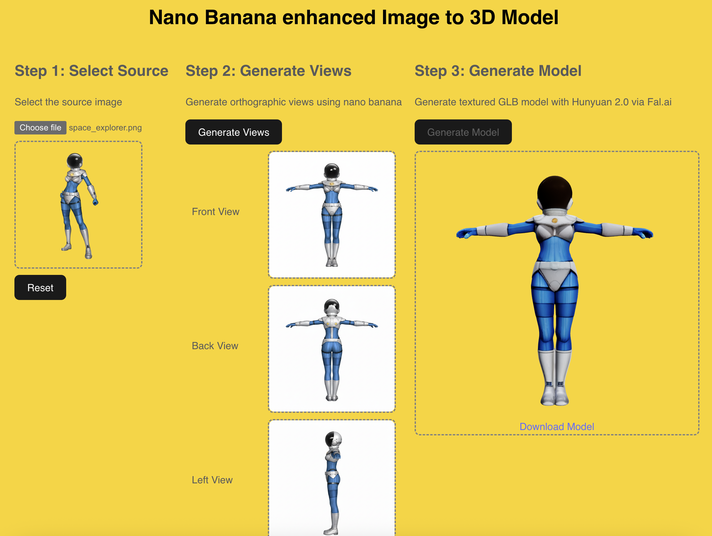
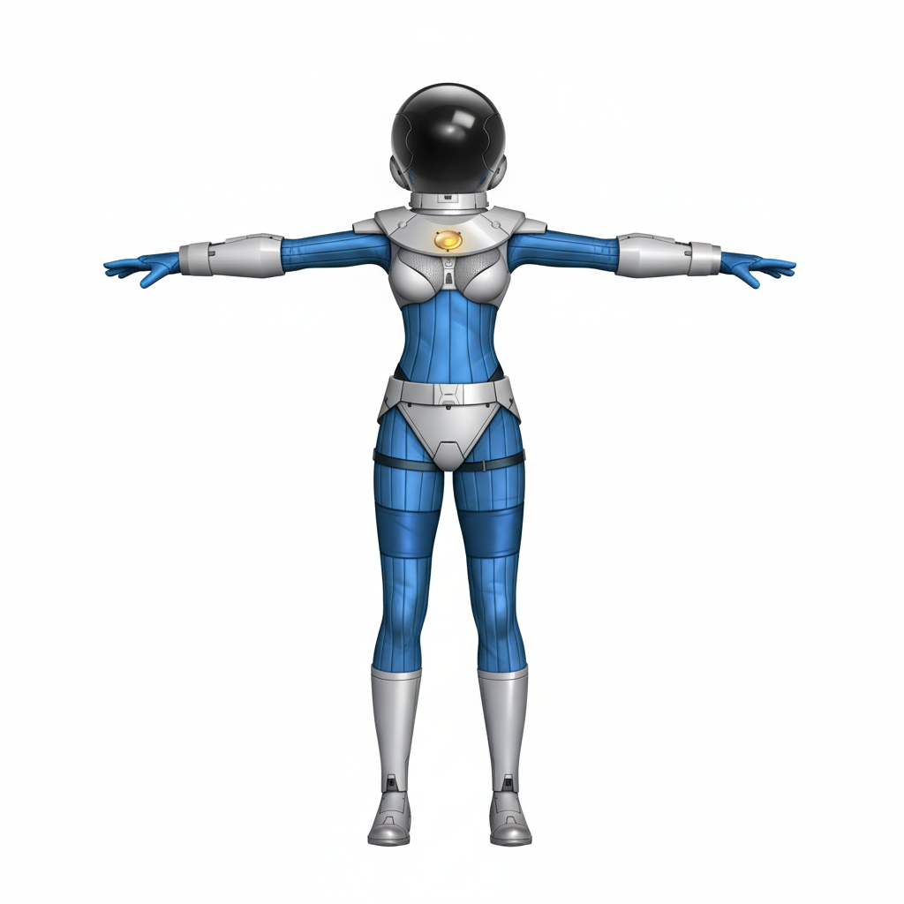

# Nano Banana enhanced Image to 3D Model


Image to 3D models CAN generate from just a single reference image. However, there can be unexpected results as the model is unable to "see" what detail should be modelled where the detail is not visible from the current view angle.

This 3D model I generated with Hunyuan 2.5 has unnaturally long the fingers on her right hand because the hand is partially hidden from view in the original source image.    

If multiple images are provided, the results are much better and more stable.

[Nano-banana (aka Gemini 2.5 Flash Image)](https://nanobanana.ai/) is very good at generating views of the same character/object from different camera angles. This is great for generating the front, back, side views which are often used in the manual 3D modelling process. 

To further improve the results, I instruct Gemini to generate the different views of the character in a T-pose like such  


I use Tencent's [Hunyuan 2.0 MultiView](https://fal.ai/models/fal-ai/hunyuan3d/v2/multi-view) which is available via FAL.ai

## Quickstart

1. Run frontend client - 
```bash
    cd banana3d-client
    # ensure that the SERVER_URL in `App.tsx` is set to `http://127.0.0.1:5500`
    npm install
    npm run dev
```

2. Run backend server -
```bash
    cd banana3d-server
    pip install -r requirements.txt
    source .venv/bin/activate
    # Create a .env file
    touch .env
    # Set your GEMINI_API_KEY=AI... and FAL_KEY=672-... in .env
    hypercorn main:app --reload --bind 127.0.0.1:5500
```


### Gemini Integration

3 API calls are made to Gemini 2.5 Flash Image (aka Nano Banana) during the generation of the view images. 
The first call generates the front image. Subsequent calls include the original image and all subsequently generated images in the prompt to try to maintain subject consistency. 

`hunyuan3d/v2/multi-view` only requires the front, back and left images so the right image is not generated.


### FAL.ai Integration

Before the hunyuan model can be invoked, the view images generated by nano-banana must be uploaded to **FAL.ai**. This is done by `fal_client.upload_file_async(view_image_path),` in `falGen3d.py`


## Copyright
The Space Explorer character and image (`space_explorer.png`) copyright belongs to Tyler Projects Pte Ltd. a company I own. You may use the image/character for testing this software. Please let [me](https://www.linkedin.com/in/leonard-lin/) know if you would like to use it for other commercial purposes. 